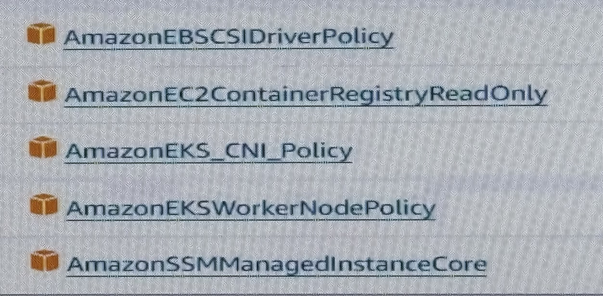

## Ebs volumes
- create EBS volume in AWS
- install EBS drivers in the EKS cluster
- attach EBS-CSI policy in the IAM role `To allow your EC2 instances (nodes) to connect with EBS (Elastic Block Store) volumes, you need to attach the AmazonEC2EBSCSI policy to the IAM role assigned to your EC2 instances`

